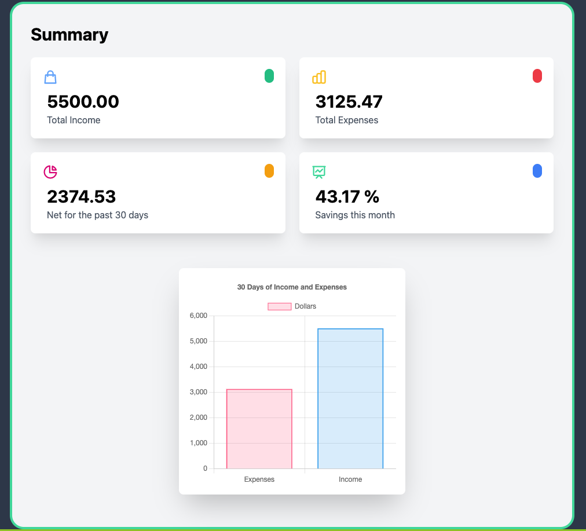
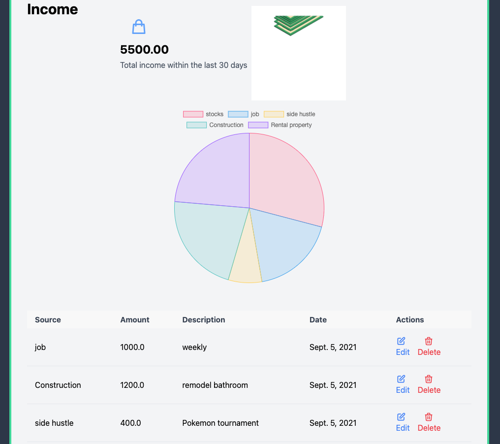
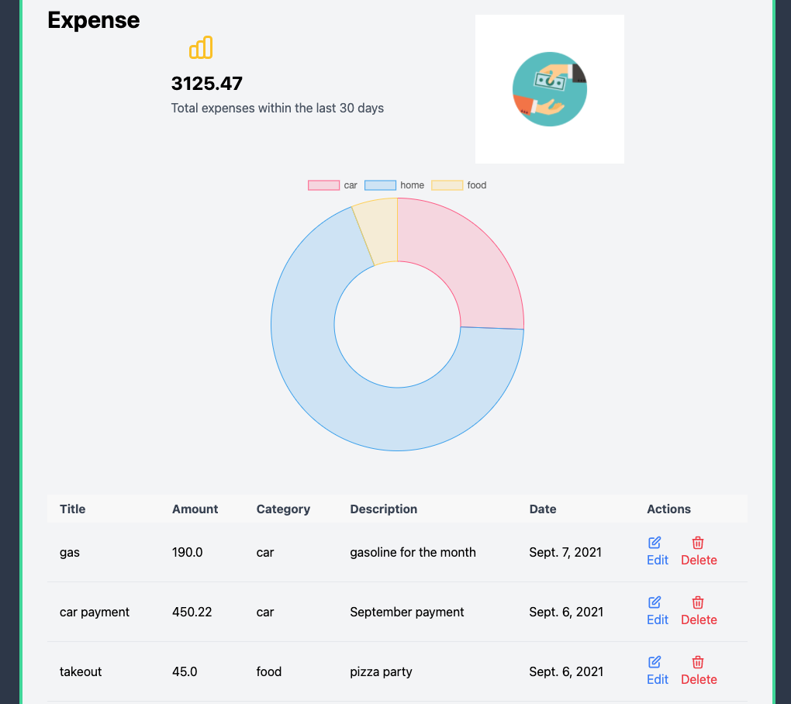

#  Expense-Tracker 
 

## Description 
In this day and age, people tend to throw away receipts or even declining them when offered which drives one to easily lose track of our expenses. What most people dont realize is that income can also be overlooked. This app allows you to track your incomes and expenses through a CRUD operated app. The user is able to keep track of their finances by creating, editing and deleting their transactions. The user is also able to visualize their income versus expense stats within the last 30 days through a calculated net worth number and savings percentage.

## Getting Started
- [Trello board](https://trello.com/b/3qVsQyqi/expense-tracker)
- [ERD](https://whimsical.com/expense-tracker-unit-4-project-98hUWtQJvVJa7WvaakfwYP)
- [Wireframes](https://whimsical.com/expense-tracker-wireframe-H5w2cJakXU1z6kADZdZuDQ)

## Screenshot(s)

## Technologies Used
<ul>
  <li>Python</li>
  <li>Javascript</li>
  <li>Django</li>
  <li>TailWindCSS</li>
  <li>CSS</li>
  <li>PostgreSQL</li>
  <li>Chart.js</li>
  <li>MCDatepicker.js</li>
</ul>

## Next Steps
<ul>
  <li>Make budget section- so the user can allocate income to specific categories of expenses</li>
  <li>Develop a debt section- so the user can keep track of bigger purchases or amount owed on a loan </li>
  <li>Make the app 100% mobile-friendly</li>
  <li>Create a portfolio section- so the user can keep track of their investments</li>
</ul>